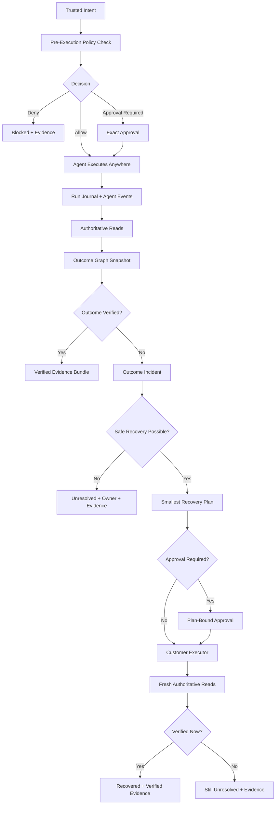

# Zroky Final Build Plan

Status: Build source of truth  
Product model: Proprietary product built on open standards  
Last updated: 2026-07-21

This document is the build-time reference for Zroky. If an implementation choice is not traceable to this document, pause and update this document before building.

## 1. Final Product Definition

Zroky is the independent governance, outcome assurance, and safe recovery layer for autonomous AI agents.

Zroky does three jobs:

1. Govern agent actions before execution.
2. Prove the actual business outcome after execution by reading authoritative systems.
3. Recover only the smallest safe missing effect, then verify again.

The product message:

```text
Your agents act. Zroky governs the attempt, proves the outcome, and safely completes what is missing.
```

## 2. Non-Negotiable Product Boundary

Zroky owns:

- trusted intent intake;
- pre-execution policy checks;
- exact approval requirements;
- immutable run journal;
- authoritative observations;
- outcome graph compilation;
- deterministic outcome verification;
- incident classification;
- minimal safe recovery planning;
- customer-local recovery execution;
- fresh post-recovery verification;
- signed evidence bundles;
- operator dashboard;
- enterprise security and audit controls.

Zroky does not own:

- agent reasoning;
- agent memory;
- prompt engineering;
- model selection;
- original workflow orchestration;
- generic LLM observability;
- generic AI control tower inventory;
- backup or rollback platform;
- universal unrestricted tool gateway;
- hard-coded workflow catalog;
- public open-source core.

## 2.1 Dashboard Replacement Boundary

The final dashboard is a brand-new operational product surface. The old dashboard must not be refactored forever.

Keep only reusable low-level utilities when they are clean and product-aligned. Remove old pages, old types, old mock fixtures, old navigation, and old product language tied to diagnosis, replay, generic observability, issue debugging, growth experiments, or prompt-level analytics.

The final dashboard must use a task-first operational IA:

```text
Home
Operations
Workflows
Systems
Evidence
Settings
```

The final dashboard must be wired to real final APIs. Mock/demo data is allowed only in tests and local fixtures.

## 2.2 GitHub And CI Boundary

GitHub must reflect the final product build, not old experiments.

Keep only workflows and checks that protect the final Zroky product:

- backend tests for final API, domain, tenancy, policy, outcome, recovery, and evidence;
- dashboard typecheck, tests, build, and browser E2E checks for the final IA;
- SDK tests for final public APIs;
- API allowlist and contract checks;
- build-plan tracker verification;
- security checks for tenant isolation, signing, and production config;
- deployment smoke tests for final API and dashboard.

Remove or archive:

- diagnosis/replay/observability-only CI jobs;
- stale demo deployment jobs;
- checks for deleted product surfaces;
- duplicate workflows;
- generated artifacts committed only for old actions;
- release jobs that can publish old product surfaces.

## 3. Product Invariants

These rules cannot be weakened:

- Agent success is never proof.
- Tool receipt is never closure proof.
- Missing evidence is not success.
- Unknown or conflicted state cannot auto-recover.
- Heuristic correlation cannot verify closure.
- High-risk recovery requires exact approval.
- Recovery repeats only missing effects, never already-complete effects.
- Dispatch timeout triggers fresh reconstruction, not blind retry.
- Changed source state invalidates pending recovery plans.
- Recovery receipt cannot close the workflow without fresh authoritative reads.
- Every final decision must be reproducible from evidence.
- Tenant isolation must hold across API, workers, cache, evidence, and exports.

## 4. Core Flow



## 5. Open Standards And OSS Usage

Zroky is not launched as OSS. Zroky may use or support open standards and open-source dependencies where useful.

Core standards to support:

- OpenTelemetry and OTLP for agent trace intake.
- OpenInference or OpenLLMetry compatibility for AI framework traces.
- MCP for tool schema import.
- A2A Agent Card for agent discovery.
- OpenAPI and AsyncAPI for API/event capability import.
- CloudEvents for event envelopes.
- CEL for bounded policy and outcome predicates.
- in-toto/DSSE-style signed attestations for evidence.
- OCEL 2.0-inspired object-centric event modeling.

Enterprise deployment references:

- Presidio-style PII redaction.
- OpenBao or Vault-compatible secrets handling.
- gVisor for sandboxed customer executor/plugin runtime.
- Tetragon for runtime enforcement and evidence.
- Kyverno for Kubernetes deployment policy.

Do not build a generic observability clone around these tools.

## 6. Final Codebase Shape

Target backend structure:

```text
zroky-backend/app/
  api/v1/
    intents.py
    policy.py
    approvals.py
    runs.py
    observations.py
    outcome_graphs.py
    incidents.py
    recovery.py
    evidence.py
    connectors.py
    systems.py
    admin.py
  domain/
    intent/
    policy/
    approval/
    assurance_pack/
    connector_manifest/
    observation/
    outcome_graph/
    incident/
    recovery/
    evidence/
    tenancy/
  infrastructure/
    db/
    outbox/
    signing/
    object_storage/
    secrets/
    telemetry/
    relay_protocol/
  worker/
    observation_jobs.py
    verification_jobs.py
    recovery_jobs.py
    evidence_jobs.py
```

Target dashboard structure:

```text
zroky-dashboard/src/app/(dashboard)/
  layout.tsx
  home/
  operations/
    runs/
    incidents/
    approvals/
  workflows/
  systems/
  evidence/
  settings/
```

Target SDK structure:

```text
zroky-sdk/zroky/
  client.py
  intent.py
  policy.py
  observe.py
  verify.py
  executor.py
  evidence.py
```

## 7. Keep, Delete, Migrate

Keep and evolve:

- action intents;
- runtime policy checks;
- approvals;
- outcome reconciliation concepts;
- system-of-record integrations;
- evidence APIs;
- customer-hosted runner/executor;
- Python and TypeScript SDKs.

Delete or archive from core:

- old dashboard navigation, pages, mocks, and types that do not map to final IA;
- diagnosis engine;
- replay worker;
- regression CI action;
- old eval detector packs;
- LLM judge calibration;
- provider drift watch;
- generic ask/intel/recommendation features;
- feature-interest polling;
- old Grafana diagnosis dashboards;
- ClickHouse path for v1;
- demo patch/image folders;
- MCP interception as a core universal gateway.

Migrate:

- current protected actions become trusted intents and pre-execution policy decisions;
- current runner becomes customer recovery executor;
- current outcome reconciliation becomes outcome graph verification;
- current evidence manifest becomes signed evidence bundle;
- current integrations become connector capability manifests plus authoritative read bindings.

## 8. Core Domain Objects

### 8.1 Trusted Intent

Fields:

- tenant_id;
- environment_id;
- intent_id;
- idempotency_key;
- issuer;
- agent_id;
- workflow_key;
- business_object_refs;
- requested_action;
- requested_effects;
- risk_context;
- expires_at;
- signature or authenticated principal;
- created_at.

### 8.2 Policy Decision

Fields:

- decision_id;
- intent_id;
- decision: allow, deny, approval_required, observe_only;
- matched_policies;
- reasons;
- risk_level;
- approval_requirements;
- policy_version;
- input_digest;
- created_at.

### 8.3 Workflow Assurance Pack

Fields:

- pack_id;
- workflow_key;
- version;
- status;
- intent_schema;
- object_types;
- required_effects;
- forbidden_effects;
- authoritative_sources;
- correlation_rules;
- freshness_rules;
- policy_bindings;
- recovery_playbooks;
- simulation_cases;
- created_by;
- approved_by;
- immutable_digest.

### 8.4 Workflow Run

Fields:

- run_id;
- tenant_id;
- environment_id;
- pack_id;
- intent_id;
- agent_id;
- started_at;
- status;
- correlation_keys;
- run_journal_ref;
- final_evidence_bundle_id.

### 8.5 Observation

Fields:

- observation_id;
- run_id;
- source_system_id;
- connector_id;
- object_ref;
- observed_state;
- observed_at_source;
- read_at;
- freshness_status;
- provenance;
- raw_artifact_ref;
- digest.

### 8.6 Outcome Graph Snapshot

Fields:

- snapshot_id;
- run_id;
- pack_id;
- expected_effects;
- actual_effects;
- missing_effects;
- wrong_effects;
- duplicate_effects;
- forbidden_effects;
- conflicted_effects;
- unknown_effects;
- classification;
- verifier_version;
- created_at;
- digest.

### 8.7 Outcome Incident

Fields:

- incident_id;
- run_id;
- snapshot_id;
- status;
- severity;
- deviation_type;
- owner;
- required_action;
- recovery_allowed;
- created_at;
- resolved_at.

### 8.8 Recovery Plan

Fields:

- recovery_plan_id;
- incident_id;
- snapshot_id;
- plan_status;
- required_capability_id;
- exact_effects_to_apply;
- already_satisfied_effects;
- risk_level;
- approval_required;
- expires_at;
- source_state_digest;
- compiled_by_version;
- digest.

### 8.9 Recovery Attempt

Fields:

- attempt_id;
- recovery_plan_id;
- executor_id;
- dispatch_id;
- idempotency_key;
- lease_token;
- nonce;
- status;
- command_digest;
- receipt;
- result_unknown;
- created_at;
- completed_at.

### 8.10 Evidence Bundle

Fields:

- evidence_bundle_id;
- run_id;
- final_status;
- intent_ref;
- policy_decision_refs;
- observation_refs;
- outcome_snapshot_ref;
- incident_ref;
- recovery_refs;
- verification_rounds;
- signer_key_id;
- dsse_envelope;
- created_at.

## 9. API Surface

Final public API allowlist:

```text
POST /v1/intents
GET  /v1/intents/{intent_id}

POST /v1/policy/check
GET  /v1/policy/decisions/{decision_id}

POST /v1/approvals/{approval_id}/approve
POST /v1/approvals/{approval_id}/deny
GET  /v1/approvals

POST /v1/runs
GET  /v1/runs
GET  /v1/runs/{run_id}

POST /v1/observations
POST /v1/observations/batch
GET  /v1/runs/{run_id}/observations

POST /v1/runs/{run_id}/verify
GET  /v1/runs/{run_id}/outcome-graph

GET  /v1/incidents
GET  /v1/incidents/{incident_id}
POST /v1/incidents/{incident_id}/assign
POST /v1/incidents/{incident_id}/resolve-manually

POST /v1/recovery/plans
GET  /v1/recovery/plans/{recovery_plan_id}
POST /v1/recovery/plans/{recovery_plan_id}/dispatch
POST /v1/executor/receipts

GET  /v1/evidence/{evidence_bundle_id}
POST /v1/evidence/{evidence_bundle_id}/verify

GET  /v1/connectors
POST /v1/connectors/manifests
GET  /v1/systems
```

All mutating endpoints must be tenant scoped and idempotent.

## 10. Dashboard Requirements

Navigation:

```text
Home
Operations
  Runs
  Incidents
  Approvals
Workflows
Systems
Evidence
Settings
```

Dashboard implementation rules:

- build a new dashboard shell for the final IA;
- remove the old dashboard after replacement pages are verified;
- no diagnosis, replay, generic observability, prompt analytics, or growth-experiment language in final navigation;
- no primary live page backed only by mock or demo data;
- every page must have loading, empty, error, and permission states;
- every user action must call a final API endpoint or be explicitly disabled;
- every destructive or recovery action must show exact policy and evidence context;
- dashboard tests must cover final user flows, not old page compatibility.

Home must show:

- verified outcomes;
- recovered outcomes;
- unresolved outcomes;
- blocked attempts;
- pending approvals;
- source freshness health;
- executor health.

Run detail must show:

- trusted intent;
- policy decision;
- agent run journal;
- expected outcome;
- actual outcome;
- authoritative evidence;
- deviation classification;
- recovery state;
- final proof.

Incident detail must show:

- exact missing/wrong/forbidden effect;
- source facts;
- why recovery is allowed or blocked;
- proposed smallest recovery;
- approval state;
- owner and next action.

Evidence detail must show:

- final status;
- signed bundle;
- source observations;
- policy decisions;
- verification rounds;
- external verification result.

## 11. Build Phases

### Phase 0: Stabilize Current Repo

Goal: stop building on dirty product surface.

Tasks:

- freeze final API allowlist;
- create route inventory: keep, delete, migrate;
- create dashboard page inventory: keep, delete, migrate;
- create old dashboard removal plan;
- create SDK module inventory: keep, delete, migrate;
- create GitHub workflow and release-surface inventory;
- remove local screenshots, patch folders, and generated artifacts;
- fix full test install issues;
- fix known TypeScript dashboard test error;
- fix API contract drift caused by feature-flag mismatch;
- fix tenant isolation/RLS gaps before recovery work.

Exit criteria:

- git status only contains intentional changes;
- core tests pass;
- legacy routes are documented with deletion target;
- old dashboard pages are documented with deletion target;
- GitHub workflows are documented with keep/delete/migrate target;
- no new product feature is added during Phase 0.

### Phase 1: Core Domain Skeleton

Goal: introduce final domain without rewriting everything.

Tasks:

- add domain modules for intent, policy, assurance_pack, observation, outcome_graph, incident, recovery, evidence;
- add database tables for final domain objects;
- add transactional outbox pattern for verification/recovery/evidence jobs;
- add tenant/environment fields to every domain object;
- add RLS or equivalent tenant checks with negative tests;
- keep old action/outcome routes working while final routes are introduced.

Exit criteria:

- final domain models exist;
- tenant negative tests cover API and worker paths;
- no recovery dispatch exists yet.

### Phase 2: Pre-Execution Governance

Goal: agent action cannot execute through Zroky without policy decision.

Tasks:

- migrate action intent to trusted intent;
- implement `/v1/policy/check`;
- implement allow, deny, approval_required, observe_only;
- implement idempotency and conflict detection;
- implement policy snapshot and decision digest;
- add exact approval requirements;
- add SDK guard/protect wrapper around policy check.

Exit criteria:

- duplicate idempotency key cannot change intent;
- untrusted issuer cannot create high-risk intent;
- approval_required pauses execution;
- deny blocks execution;
- decision evidence is stored.

### Phase 3: Universal Intake

Goal: Zroky can observe agent/workflow runs without owning the agent.

Tasks:

- add REST/webhook run intake;
- add CloudEvents envelope support;
- add OTLP/OpenTelemetry ingestion path or collector integration;
- add MCP tool schema import;
- add A2A Agent Card import;
- add OpenAPI capability import;
- normalize events into immutable run journal;
- redact PII before exportable evidence.

Exit criteria:

- one custom agent can integrate through REST/webhook;
- one traced agent can integrate through OTLP-compatible trace input;
- one MCP tool set can be imported as untrusted capability draft;
- imported capabilities are not auto-trusted for recovery.

### Phase 4: Assurance Pack Compiler

Goal: workflow correctness is defined as data, not hard-coded code.

Tasks:

- define Workflow Assurance Pack schema;
- support object types, effects, source bindings, correlation rules, freshness rules, and recovery playbooks;
- use CEL for bounded predicates;
- add simulation cases;
- add pack versioning and immutable digest;
- add dashboard workflow builder minimal UI.

Exit criteria:

- new workflow can be represented without backend code change;
- pack cannot be mutated after publish;
- all verification uses a pack version.

### Phase 5: Authoritative Observation And Verification

Goal: agent success can be proven or rejected by source-of-truth reads.

Tasks:

- implement customer read relay protocol;
- implement generic REST authoritative read connector;
- implement Postgres read connector;
- implement one financial/source connector based on current Stripe-style path;
- store observations immutably;
- build outcome graph snapshot from observations;
- classify verified, missing, wrong, duplicate, forbidden, stale, conflicted, unknown;
- generate unresolved state when evidence is insufficient.

Exit criteria:

- agent success alone cannot verify run;
- missing source read creates unresolved or not verified state;
- wrong value and duplicate are distinct classifications;
- heuristic correlation cannot produce verified status.

### Phase 6: Incident Lifecycle

Goal: deviations become operator-actionable incidents.

Tasks:

- create incidents from outcome snapshots;
- add assignment, status, severity, owner, next action;
- add manual remediation path;
- re-verify after manual remediation;
- build brand-new dashboard shell and navigation for final IA;
- build Operations/Runs/Incidents dashboard;
- remove old dashboard routes after replacement pages are verified.

Exit criteria:

- every non-verified run has reason and owner path;
- manual resolution cannot close without fresh verification;
- dashboard shows expected vs actual clearly.
- final dashboard has no old diagnosis/replay primary pages.
- dashboard flows use final APIs instead of demo-only state.

### Phase 7: Safe Recovery

Goal: execute only smallest allowed correction through customer-local executor.

Tasks:

- evolve current runner into customer recovery executor;
- add executor registration and capability manifests;
- add recovery playbook registry;
- compile smallest recovery plan from missing effects;
- add plan-bound approval;
- add lease, nonce, fencing, idempotency;
- dispatch signed executor command;
- store recovery receipt;
- re-read all authoritative sources after attempt;
- handle result_unknown by reconstruction, not retry.

Exit criteria:

- already-satisfied effect is never repeated;
- unknown/conflicted state blocks auto-dispatch;
- high-risk plan cannot dispatch without exact approval;
- timeout triggers fresh reads;
- receipt alone cannot close run.

### Phase 8: Evidence

Goal: final decision is signed, reproducible, and exportable.

Tasks:

- implement evidence bundle schema;
- use DSSE/in-toto-style envelope;
- sign bundle with deployment key;
- include intent, decisions, observations, snapshots, incidents, recovery, verification rounds;
- add verifier endpoint;
- add export/download;
- add Evidence dashboard page.

Exit criteria:

- evidence replay reproduces final status;
- tampered bundle fails verification;
- missing observation prevents verified replay;
- exported evidence avoids unredacted PII unless explicitly authorized.

### Phase 9: Enterprise Hardening

Goal: product is deployable for real customers.

Tasks:

- SSO/SAML/OIDC;
- SCIM or minimal user provisioning;
- RBAC and separation of duties;
- audit log;
- customer-local secrets with OpenBao/Vault-compatible option;
- object storage retention and legal hold;
- private networking option;
- executor sandbox option with gVisor;
- runtime enforcement evidence option with Tetragon;
- Kubernetes policies with Kyverno;
- disaster recovery runbook;
- production config validator.

Exit criteria:

- cross-tenant negative tests pass;
- production config fails closed when secrets/signing/RLS are missing;
- executor cannot call arbitrary host or run arbitrary command;
- audit covers every privileged and recovery action.

### Phase 10: Design Partner Validation

Goal: prove workflow-agnostic live product.

Tasks:

- run 3 to 5 design partner workflows with different shapes;
- include at least one linear workflow;
- include at least one branching workflow;
- include at least one multi-system workflow;
- include at least one human-approval workflow;
- include at least one recovery workflow;
- measure unresolved rate, recovery rate, false verified count, duplicate effect count, time to first verified run;
- run full browser E2E checks for policy, verification, incident, recovery, and evidence flows;
- run deployment smoke tests against the final API and dashboard.

Exit criteria:

- zero false verified outcomes;
- zero unauthorized recovery dispatches;
- zero duplicate recovery effects;
- every unresolved outcome has reason and owner;
- at least one workflow added without core backend code change;
- final dashboard supports the complete live operator flow;
- final production deployment smoke test passes.

### Phase 11: Live Launch Cutover

Goal: ship the final product surface and remove old product surfaces from production.

Tasks:

- remove old dashboard pages and routes from production build;
- remove or archive old backend routes that are not on the final API allowlist;
- remove old SDK exports that encourage diagnosis/replay/observability product usage;
- remove or rewrite GitHub workflows that publish or test old product surfaces;
- verify final dashboard against production-like APIs;
- verify billing, account, and settings flows if enabled for launch;
- verify deployment rollback path;
- produce final launch report.

Exit criteria:

- production build exposes only final product navigation;
- production API exposes only final allowlisted routes plus required auth, billing, and admin routes;
- no old demo or mock data powers live pages;
- GitHub required checks match the final product gates;
- final launch report is complete;
- rollback path is documented and tested.

### Phase 12: Verification Connector Fabric

Goal: make Zroky system-agnostic without hand-building every SaaS connector.

Product rule:

- one-click connect means read-only proof access, least-privilege scopes, successful test-read, known object schema, correlation rule, freshness rule, and an installed evidence template;
- one-click connect does not mean Zroky receives write access or executes customer-side actions;
- Slack, Teams, and email approval paths are interaction surfaces, not business proof connectors unless verifying message delivery itself.

Tasks:

- add a declarative connector manifest contract for `generic_rest`, `webhook_callback`, and `postgres_read`;
- wire existing `ToolRegistryItem` connector catalog rows to manifest IDs instead of creating a second catalog;
- enforce read-only manifest rules at validation time: no mutation methods, no write scopes, no raw customer secrets in the control plane;
- prove Generic REST and Postgres source-of-record verification through manifest data, not new backend connector code;
- wire `webhook_callback` as signed inbound observation intake, not as a pull-read runtime;
- prove at least two source families in one outcome graph before adding more presets;
- ship branded presets as manifest data first: Stripe, GitHub, Jira, ServiceNow, Salesforce, HubSpot, Zendesk, Shopify;
- add bespoke auth adapters only where the primitive cannot safely cover auth, such as GitHub App installation tokens or OAuth refresh;
- install starter Assurance Pack templates from connector manifests so verification semantics live in data, not hardcoded routes;
- keep dashboard UI manifest-driven and build it after backend contract tests pass.

Exit criteria:

- a new source-of-record workflow can be added with manifest data and an Assurance Pack template, without a new backend route or service;
- Generic REST, Webhook, and Postgres are launch-grade primitives;
- branded connector presets declare capabilities, auth mode, test-read, object schema, correlation, freshness, and evidence template;
- interaction surfaces are not counted as verification connectors;
- production validation fails closed for write-capable manifests, missing test-read config, missing correlation rules, or raw secret storage.

## 12. Testing Strategy

Required test groups:

- final dashboard browser E2E tests for the complete operator flow;
- final API contract allowlist tests;
- unit tests for CEL predicate evaluation;
- unit tests for policy decision precedence;
- unit tests for idempotency conflict;
- unit tests for outcome classification;
- unit tests for recovery plan compiler;
- unit tests for DSSE/evidence verification;
- integration tests for intent -> policy -> run -> observation -> verification;
- integration tests for incident -> recovery -> fresh verification;
- tenant isolation negative tests for API and workers;
- executor protocol tests for expired, replayed, mismatched, stale-fence commands;
- dashboard tests for Runs, Incidents, Approvals, Evidence;
- production smoke tests for final API and dashboard.

Do not add broad test suites for deleted legacy products.

## 13. Security Gates

Before enabling recovery in any environment:

- tenant isolation verified;
- command signing verified;
- executor nonce/replay protection verified;
- idempotency verified;
- source-state digest invalidation verified;
- approval binding verified;
- arbitrary URL/host execution blocked;
- raw connector credentials absent from control plane;
- recovery disabled for unknown/conflicted states;
- audit log complete.

## 14. Live Readiness Gates

Zroky is live-ready only when:

- final API allowlist is stable;
- old diagnosis/replay/observability product surfaces are removed from production;
- old dashboard pages, navigation, fixtures, and primary types are removed or archived outside the production app;
- one workflow runs end to end in observe-only mode;
- one workflow runs end to end with approval-controlled recovery;
- signed evidence verifies independently;
- dashboard operators can resolve incidents without database access;
- final dashboard works end to end with real APIs, including loading, empty, error, and permission states;
- production smoke test passes for dashboard and API;
- production config validation fails closed;
- cross-tenant testing is automated;
- no high-risk automatic recovery is enabled by default.

## 15. Build-Time Anti-Hallucination Rules

Before building any feature, answer these:

1. Which section of this document requires it?
2. Is it core, plugin, or deleted legacy?
3. Does it strengthen pre-execution governance, outcome proof, recovery, or evidence?
4. Can it be represented as an Assurance Pack or connector manifest instead of code?
5. Does it require new dependency? If yes, why existing code or standard library is insufficient?
6. What is the smallest runnable test proving it?
7. What is the rollback or disable path?

Do not build:

- speculative connector marketplaces;
- generic AI observability pages;
- prompt debugging UI as primary product;
- new workflow engines;
- new agent frameworks;
- high-risk auto recovery;
- second policy language before CEL is insufficient;
- extra databases before Postgres becomes the bottleneck.

## 16. First Concrete Engineering Cut

The first implementation cut is not recovery. It is product surface cleanup and final kernel preparation.

Tasks:

1. Route inventory and API allowlist.
2. Dashboard page inventory.
3. SDK module inventory.
4. Delete local/generated artifacts.
5. Fix current test/build blockers.
6. Fix tenant isolation gaps.
7. Add final domain skeleton.
8. Build the new dashboard shell only after final API/page inventory is agreed.

Only after that, build final pre-execution policy, then authoritative verification, then recovery.
